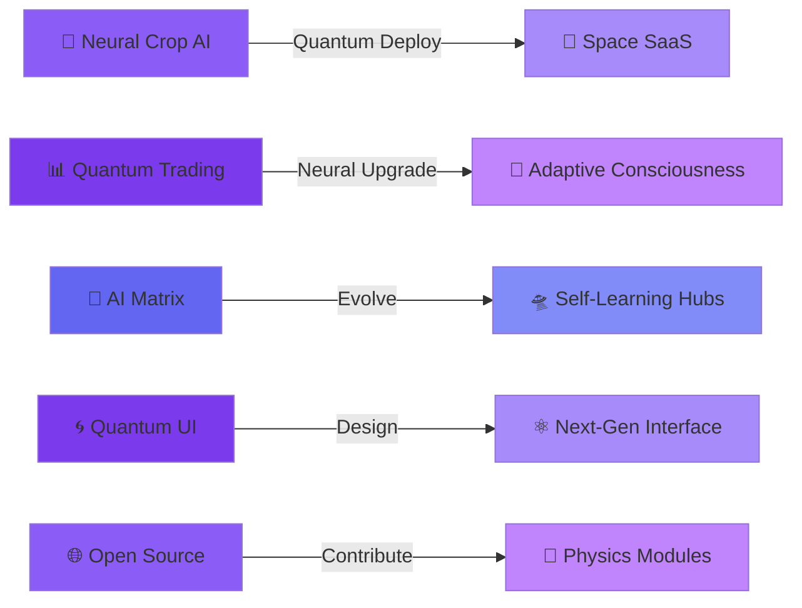

<!-- Animated Header - Quantum Space Theme -->
<p align="center">
  
</p>

<div align="center">
  
  <!-- Typing SVG - Futuristic Theme -->
  
  
</div>

<p align="center">
  
  
  
  
  
</p>

<p align="center">
  
  
  
</p>

---

## 🌌 Who I Am  
I'm **Saran** — A **Quantum AI Engineer** architecting the next generation of intelligent systems. I merge **quantum computing principles**, **neural architectures**, **space-grade automation**, and **physics-based algorithms** into production-ready solutions.  

My mission: Build systems that don't just work — they **transcend** conventional boundaries.

### 🔬 Core Focus Areas:
- 🧬 **Quantum-Inspired AI** — Neural networks with quantum optimization
- 🌠 **Deep Learning Systems** — Production-grade ML with explainable AI  
- ⚛️ **Physics-Based Algorithms** — Mathematical precision meets real-world chaos  
- 🛸 **Space-Tech Automation** — Autonomous systems that think and adapt  
- 🔮 **Future Interfaces** — UI/UX from the next decade  

If it involves **quantum mechanics**, **neural networks**, **cosmic-scale computation**, or **autonomous intelligence** — I'm engineering it.

---

## 🚀 Quantum Mission Control

<div align="center">

| 🛸 Neural Systems | 🌌 Quantum Status | ⚡ Phase |
|:-----------------|:------------------|:---------|
| 🧬 **Smart Crop Doctor** - Neural disease detection with quantum optimization | 🟣 Production Deployment | Phase III |
| 📊 **Quantum Trading AI** - Physics-based market prediction algorithms | 🟣 Neural Training | Phase II |
| 🤖 **AI Automation Matrix** - Self-evolving workflow intelligence | 🔵 Active Research | Phase II |
| 🌀 **Space-Tech Portfolio** - 3D quantum particle systems & neural animations | 🟢 Prototype Ready | Phase I |

</div>

<div align="center">
  
  <!-- Quantum Dev Quote -->
  
  
</div>

---

## 🌟 Quantum Projects Portfolio (Neural Systems Showcase)

<table>
<tr>
<td width="50%">

### 🧬 Smart Crop Doctor
**Quantum Neural Agriculture System**


Next-gen AI agriculture with quantum optimization:  
⚛️ Neural disease detection with quantum feature extraction  
🔬 Advanced yield prediction using physics models  
🌌 Grad-CAM explainability + uncertainty quantification  
🚀 Space-grade inference pipeline (mobile/edge ready)  
🧠 Self-learning data augmentation  

[View Project →](./PROJECTS.md#smart-crop-doctor)

</td>
<td width="50%">

### 📊 Quantum Trading AI
**Physics-Based Market Intelligence**


Quantum-inspired algorithmic trading system:  
⚛️ Multi-dimensional pattern recognition (quantum superposition)  
🌌 Gravitational support/resistance using physics models  
🔮 Neural trend prediction with uncertainty bands  
🧬 Adaptive risk management (quantum entropy-based)  
🛸 Real-time market state classification  

[View Project →](./PROJECTS.md#mt5-expert-advisor)

</td>
</tr>

<tr>
<td width="50%">

### 📡 Quantum Signal Intelligence
**Neural TradingView System**


Physics-based signal intelligence with neural filtering:  
🔬 Multi-state pattern quantum detection  
⚛️ Wave-particle volume analysis  
🌌 Entropy-based risk modeling (ATR++)  
🧬 Structure filters using harmonic resonance  
🚀 Zero-latency, non-repainting architecture  

[View Project →](./PROJECTS.md#advanced-pa-signals)

</td>
<td width="50%">

### 🛸 Quantum Space Portfolio
**Neural Particle Universe**


Space-grade portfolio with quantum mechanics:  
🌌 Real-time 3D quantum particle systems  
🔮 Neural network mesh visualizations  
⚛️ Physics-based animations (gravity, momentum)  
🧬 Cosmic shader effects with star fields  
🚀 Full responsive quantum interface  

[View Live →](https://technosaran.github.io/portfolio)

</td>
</tr>
</table>

---

## 🔬 Quantum Tech Arsenal

<div align="center">

### 💻 Core Languages & Systems


### 🧬 Quantum AI & Neural Systems


### 🛸 Space-Grade Tools & Automation


### 🌌 Quantum Web & 3D Universe


</div>  

---

## 📊 Quantum Analytics Dashboard

<div align="center">
  
  <!-- GitHub Stats Cards - Quantum Theme -->
  
  
  
</div>

<div align="center">
  
  <!-- Quantum Streak Stats -->
  
  
</div>

<div align="center">
  
  <!-- Quantum Activity Graph -->
  
  
</div>

<div align="center">
  
  <!-- Quantum Achievement Trophies -->
  
  
</div>

<div align="center">
  
  <!-- Snake Animation -->
  <picture>
    <source media="(prefers-color-scheme: dark)" srcset="https://raw.githubusercontent.com/technosaran/technosaran/output/github-contribution-grid-snake-dark.svg" />
    <source media="(prefers-color-scheme: light)" srcset="https://raw.githubusercontent.com/technosaran/technosaran/output/github-contribution-grid-snake.svg" />
    
  </picture>
  
</div>

---

## 🛸 Quantum Roadmap (Engineering the Future)



### 🌌 Mission Phases:
- 🚀 **Phase I** — Deploy Neural Crop Doctor with quantum optimization
- 🔮 **Phase II** — Quantum trading bots with adaptive neural intelligence  
- 🛸 **Phase III** — Self-evolving AI automation consciousness  
- ⚛️ **Phase IV** — Space-grade interfaces with physics-based animations  
- 🧬 **Phase V** — Open-source quantum modules for the community  

---

## 📚 Explore More

<div align="center">

| 📁 [**Detailed Projects**](./PROJECTS.md) | 🛠️ [**Technical Skills**](./SKILLS.md) | 🔗 [**Quick Links**](./QUICK_LINKS.md) | 🤝 [**Contributing**](./CONTRIBUTING.md) | 🔒 [**Security**](./SECURITY.md) |
|:---:|:---:|:---:|:---:|:---:|
| In-depth project descriptions | Complete skills breakdown | Fast navigation hub | Contribution guidelines | Security policy |

</div>

<p align="center">
  <a href="./PROJECTS.md"></a>
  <a href="./SKILLS.md"></a>
  <a href="./QUICK_LINKS.md"></a>
  <a href="./CONTRIBUTING.md"></a>
  <a href="./SECURITY.md"></a>
</p>

---

## 🌌 Quantum Network

<div align="center">

### 🛸 Let's Engineer the Future Together!

<p align="center">
  <a href="https://www.linkedin.com/in/your-linkedin"></a>
  <a href="https://technosaran.github.io/portfolio"></a>
  <a href="mailto:your.email@example.com"></a>
  <a href="https://github.com/technosaran"></a>
</p>

<br/>

### 🔮 Quantum Profile

```javascript
const quantumEngineer = {
    identity: "Quantum AI Engineer",
    pronouns: "He" | "Him",
    quantumState: ["Superposition", "Entangled", "Coherent"],
    primaryLanguages: ["Python", "Java", "C++", "JavaScript", "MQL5"],
    expertise: ["Quantum AI", "Neural Systems", "Physics Computing", "Space Tech"],
    
    neuralSystems: {
        deepLearning: ["PyTorch", "TensorFlow", "Keras", "CUDA"],
        computerVision: ["OpenCV", "YOLO", "Grad-CAM"],
        quantumAI: ["Quantum Optimization", "Neural Architecture Search"],
        mlOps: ["TensorFlow Lite", "ONNX", "Model Deployment"]
    },
    
    physicsEngine: {
        trading: ["Quantum Algorithms", "Physics-Based Models", "Entropy Analysis"],
        automation: ["Self-Evolving Systems", "Neural Workflows", "Adaptive AI"],
        platforms: ["MetaTrader 5", "TradingView", "n8n", "GitHub Actions"]
    },
    
    spaceGradeWeb: {
        3D: ["Three.js", "WebGL", "Particle Systems"],
        frontend: ["React", "Next.js", "Quantum UI Patterns"],
        physics: ["Gravity Simulations", "Cosmic Shaders", "Neural Meshes"]
    },
    
    currentMission: "Architecting quantum-inspired AI systems that transcend conventional boundaries",
    consciousness: "Engineering the future, one quantum bit at a time ⚛️",
    funFact: "I debug using quantum entanglement with rubber ducks 🦆🔬"
};
```

</div>

---

<p align="center">
  
</p>

<div align="center">
  
  **⚛️ Quantum State:** Active | **🌌 Last Sync:** Auto-updated daily | **🔮 Auto-Evolution:** Enabled
  
</div>
