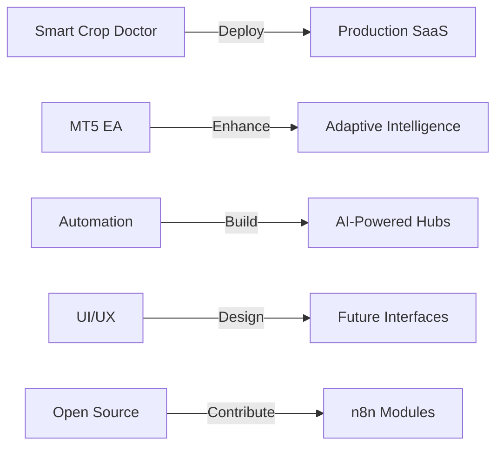

<!-- Animated Header -->

  

  
  <!-- Typing SVG -->
  
  

  
  
  
  
  

  
  
  

---

## 🔥 Who I Am  
Yo, I'm **Saran** — the guy who loves mixing **AI**, **automation**, **clean engineering**, and **algorithmic intelligence** into actual working systems.  
I don't believe in "just finishing assignments." I build things that look futuristic and work like modern tech is supposed to.

I'm all about:
- AI that solves real-world problems  
- Automation that removes human effort  
- Trading algorithms that think smarter  
- Clean, scalable engineering  
- UI/UX that feels like it came from the future  

If it's modern, fast, automated, or intelligent — I'm probably building it.

---

## ⚡ Highlight Projects (My Best Work)

<table>
<tr>
<td width="50%">

### 🌱 Smart Crop Doctor
**AI Agriculture System**

A full AI product for farmers:  
✔ Plant disease detection  
✔ Yield prediction  
✔ Grad-CAM explainability  
✔ Optimized inference pipeline  
✔ Real-world use case ready  

[View Project →](./PROJECTS.md#smart-crop-doctor)

</td>
<td width="50%">

### 📈 MT5 Expert Advisor
**Ultimate Price Action EA**

A full-blown algo trading engine:  
✔ Candlestick pattern recognition  
✔ Support/Resistance logic  
✔ EMA + Trend filters  
✔ ATR SL/TP engine  
✔ Dynamic risk management  

[View Project →](./PROJECTS.md#mt5-expert-advisor)

</td>
</tr>

<tr>
<td width="50%">

### 📊 Advanced PA Signals
**TradingView Indicator**

A Pine Script indicator that ACTUALLY filters noise:  
✔ Engulfing detection  
✔ Pin Bar detection  
✔ Volume confirmation  
✔ ATR-based risk model  
✔ Structure filters  

[View Project →](./PROJECTS.md#advanced-pa-signals)

</td>
<td width="50%">

### 🌀 Futuristic Portfolio
**3D Neural Network Theme**

My personal portfolio:  
✔ Animated AI-inspired 3D background  
✔ Neural-like visualizations  
✔ Minimal & modern  
✔ Responsive design  

[View Live →](https://technosaran.github.io/portfolio)

</td>
</tr>
</table>

---

## 🧠 Tech Stack

### 💻 Languages

### 🤖 AI/ML & Data Science

### 🛠️ Tools & Platforms

### 🌐 Web & Frontend

  

---

## 📊 GitHub Analytics

  
  <!-- GitHub Stats Cards -->
  
  
  

  
  <!-- GitHub Streak Stats -->
  
  

  
  <!-- GitHub Activity Graph -->
  
  

  
  <!-- GitHub Trophies -->
  
  

---

## 🧩 Roadmap (The Future I'm Building)

- 🚀 Deploying Smart Crop Doctor as a real SaaS  
- 🤖 Building AI-powered automation hubs  
- 📈 Creating next-gen MQL5 bots with adaptive intelligence  
- 🎨 Designing cleaner, future-themed interfaces  
- 🌐 Contributing to open-source automation modules  

---

## 📚 Explore More

| 📁 [**Detailed Projects**](./PROJECTS.md) | 🛠️ [**Technical Skills**](./SKILLS.md) | 🔗 [**Quick Links**](./QUICK_LINKS.md) | 🤝 [**Contributing**](./CONTRIBUTING.md) |
|:---:|:---:|:---:|:---:|
| In-depth project descriptions | Complete skills breakdown | Fast navigation hub | Contribution guidelines |

  
  
  
  

---

## 🔗 Connect With Me

### Let's Build Something Amazing Together!

  
  
  
  

---

  

  
  **Last update:** 2025-12-10 18:29 UTC | **Auto-updated daily** ⚡
  

