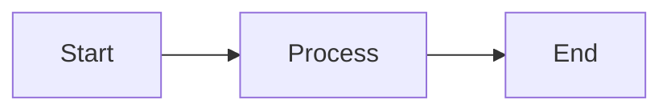

# 🌌 Quantum Visual Guide

A complete visual reference for your quantum GitHub profile with space-grade examples and cosmic customization options.

---

## 🌟 Quantum Visual Elements

### 1. Quantum Animated Header
```markdown

```

**Quantum Features:**
- Space-grade waving animation
- Purple/Blue cosmic gradient colors
- Quantum twinkling effect
- Custom height (200px for more impact)
- Subtitle with quantum descriptors

**Quantum Customization:**
- Change `customColorList`: 12,14,24,30 (purple/blue cosmos for quantum theme)
- Change `type`: waving, wave, rect, slice, shark, cylinder, venom, soft, rounded
- Change `animation`: fadeIn, scaleIn, blink, twinkling (twinkling = quantum effect)
- Change `height`: Any number (recommended: 180-250 for quantum impact)
- Change `desc`: Add quantum descriptors (AI, ML, Space, Physics, Quantum)

---

### 2. Quantum Typing Animation
```markdown

```

**Quantum Features:**
- Futuristic typewriter effect with Orbitron font
- Multiple quantum-themed rotating lines
- Purple cosmic color (A78BFA)
- Centered quantum alignment
- Increased size for impact

**Quantum Customization:**
- Change `font`: Orbitron (futuristic), Fira+Code, Roboto, Courier+New
- Change `weight`: 700 (bold) for quantum impact
- Change `size`: 24-28 for futuristic presence
- Change `color`: A78BFA (purple), 8B5CF6 (deep purple), C084FC (light purple)
- Change `lines`: Use quantum terms: Neural, Quantum, Physics, Space, Cosmic, AI
- Use • instead of | for modern separation

---

### 3. Quantum Status Badges
```markdown


```

**Quantum Badge Philosophy:**
- Use quantum/space emojis: 🧬 ⚛️ 🌌 🔬 🛸 🔮
- Use quantum colors: 8B5CF6, A78BFA, C084FC, 7C3AED
- Add relevant logos: atom, rocket, moleculer, tensorflow
- Use descriptive quantum text

**Styles:**
- `for-the-badge` - Large quantum badges (recommended)
- `flat` - Minimal flat design
- `flat-square` - Modern square edges

**Quantum Color Codes:**
- `8B5CF6` - Deep Quantum Purple
- `A78BFA` - Quantum Purple
- `C084FC` - Light Quantum Purple
- `7C3AED` - Royal Purple
- `6366F1` - Quantum Indigo

**Quantum Logos:**
- `atom` - Quantum physics
- `rocket` - Space tech
- `moleculer` - Physics/chemistry
- `tensorflow` - AI/ML
- `dependabot` - Automation

---

### 4. Profile Metrics
```markdown


```

**Available Metrics:**
- Profile views (komarev counter)
- Followers count
- Total stars
- Repository count
- Commit count

---

### 5. Tech Stack Badges

#### Language Badges
```markdown


```

#### Framework Badges
```markdown


```

**Find More Logos:**
- Visit [Simple Icons](https://simpleicons.org)
- Search for your technology
- Copy the slug name
- Use in badge URL: `logo=slug-name`

---

### 6. Quantum GitHub Stats Cards

#### Quantum Stats Card
```markdown

```

**Quantum Parameters:**
- `show_icons=true` - Show quantum icons
- `theme=radical` - Quantum purple theme (radical/tokyonight work well)
- `include_all_commits=true` - Count all quantum commits
- `count_private=true` - Include private neural repos
- `hide_border=true` - Remove border for cosmic effect
- `bg_color=0d1117` - Deep space background
- `title_color=A78BFA` - Quantum purple title
- `icon_color=C084FC` - Light purple icons
- `text_color=e9d5ff` - Pale purple text
- `ring_color=8B5CF6` - Deep purple ring

**Quantum Theme Recommendation:**
Use `radical` theme as base, then override with quantum purple colors for perfect consistency.

#### Top Languages Card
```markdown

```

**Layouts:**
- `compact` - Compact view (current)
- `default` - Standard view
- `donut` - Donut chart
- `donut-vertical` - Vertical donut
- `pie` - Pie chart

---

### 7. Quantum Streak Stats
```markdown

```

**Quantum Custom Colors:**
- `background=0d1117` - Deep space black
- `ring=A78BFA` - Quantum purple ring
- `fire=C084FC` - Light purple fire (quantum energy)
- `currStreakLabel=8B5CF6` - Deep purple label
- `sideNums=e9d5ff` - Pale purple numbers
- `sideLabels=c4b5fd` - Light purple labels
- `dates=a78bfa` - Quantum purple dates

**Quantum Effect:**
The purple fire represents quantum energy, the ring shows the quantum field, and all colors align with the cosmic purple theme.

---

### 8. Quantum Activity Graph
```markdown

```

**Quantum Themes:**
- `react-dark` - Works well with quantum colors
- `dracula` - Purple-based theme
- `tokyo-night` - Dark with good purple support

**Quantum Custom Colors:**
- `bg_color=0d1117` - Deep space background
- `color=A78BFA` - Quantum purple bars
- `line=8B5CF6` - Deep purple line
- `point=C084FC` - Light purple points
- `area=true` - Enable area fill
- `area_color=7C3AED` - Royal purple area fill

**Quantum Visualization:**
The graph represents neural activity with quantum-colored contributions forming a cosmic activity pattern.

---

### 9. GitHub Trophies
```markdown

```

**Options:**
- `row` - Number of rows
- `column` - Number of columns
- `no-frame` - Remove frame
- `no-bg` - Transparent background
- `theme` - Color theme
- `rank` - Filter by rank (SSS,SS,S,AAA,AA,A,B,C)

---

### 10. Project Cards (Table Layout)

```markdown
<table>
<tr>
<td width="50%">

### 🌱 Project Name
**Subtitle**


Description and features

[View Project →](link)

</td>
<td width="50%">

### 📈 Another Project
**Subtitle**


Description

[View Project →](link)

</td>
</tr>
</table>
```

**Benefits:**
- Side-by-side layout
- Visual organization
- Easy to scan
- Professional look

---

## 🎨 Quantum Color Schemes

### Current Theme: Quantum Purple Cosmos
- Background: `#0d1117` (Deep Space Black)
- Primary: `#A78BFA` (Quantum Purple)
- Secondary: `#8B5CF6` (Deep Purple)
- Tertiary: `#C084FC` (Light Purple)
- Accent: `#7C3AED` (Royal Purple)
- Text: `#e9d5ff` (Light Purple Text)

**Quantum Philosophy:**
This theme represents the quantum realm, deep space, neural networks, and futuristic technology. Purple signifies intelligence, innovation, and the mysteries of quantum physics.

### Color Palette Reference

#### Quantum Purple Scale
- `#6366F1` - Indigo (Strong)
- `#7C3AED` - Royal Purple (Accent)
- `#8B5CF6` - Deep Purple (Secondary)
- `#A78BFA` - Quantum Purple (Primary)
- `#C084FC` - Light Purple (Tertiary)
- `#e9d5ff` - Pale Purple (Text)

### Alternative Quantum Themes

#### Cosmic Blue-Purple
- Background: `#0d1117`
- Primary: `#818CF8` (Indigo)
- Accent: `#A78BFA` (Purple)

#### Deep Space Purple
- Background: `#1e1b4b` (Deep Purple Space)
- Primary: `#A78BFA` (Quantum Purple)
- Accent: `#C084FC` (Light Purple)

#### Neural Network Green-Purple
- Background: `#0d1117`
- Primary: `#A78BFA` (Quantum Purple)
- Accent: `#10b981` (Neural Green)

---

## 🔧 Customization Tips

### 1. Consistent Color Scheme
Use the same colors across all elements:
- Badges: `color=00eaff`
- Stats: `title_color=00eaff&icon_color=00eaff`
- Streak: `ring=00eaff&fire=00eaff`

### 2. Alignment
Center everything for professional look:
```markdown
<div align="center">
  <!-- Your content -->
</div>
```

### 3. Spacing
Add `---` between sections for visual separation.

### 4. Badge Grouping
Group related badges together:
- Languages in one section
- Frameworks in another
- Tools in another

### 5. Responsive Images
Use `height` parameter to keep images consistent:
```markdown

```

---

## 📊 Layout Patterns

### Pattern 1: Hero Section
```
Header Image
↓
Typing Animation
↓
Status Badges
↓
Metrics (Views, Followers, Stars)
```

### Pattern 2: Content Sections
```
About Me
↓
Projects (Table Layout)
↓
Tech Stack (Grouped Badges)
↓
GitHub Stats (Multiple Cards)
```

### Pattern 3: Footer
```
Navigation Links
↓
Social Badges
↓
Footer Image
↓
Timestamp
```

---

## 🚀 Advanced Features

### Mermaid Diagrams
```markdown

```

### Collapsible Sections
```markdown
<details>
<summary>Click to expand</summary>

Hidden content here

</details>
```

### Custom HTML
```markdown
<div align="center">
  <h3>Custom Heading</h3>
  <p>Custom paragraph</p>
</div>
```

---

## 📱 Mobile Optimization

### Tips:
1. Use `width=100%` for full-width images
2. Stack elements vertically
3. Use responsive tables
4. Test on mobile view
5. Keep text readable (min 16px)

---

## 🎯 Best Practices

### Do's ✅
- Use consistent colors
- Keep it organized
- Update regularly
- Test all links
- Optimize image sizes
- Use alt text

### Don'ts ❌
- Overload with badges
- Use too many colors
- Forget mobile users
- Leave broken links
- Use low-quality images
- Ignore accessibility

---

## 🔄 Update Frequency

### Automated (via GitHub Actions):
- Timestamp: Daily
- Stats: Every 6 hours
- Activity graph: Real-time

### Manual:
- Project descriptions: As needed
- Tech stack: When learning new tech
- Links: When adding new projects

---

## 📚 Resources

### Badge Generators
- [Shields.io](https://shields.io) - Custom badges
- [Simple Icons](https://simpleicons.org) - Logo slugs

### Stats Services
- [GitHub Readme Stats](https://github.com/anuraghazra/github-readme-stats)
- [GitHub Streak Stats](https://github.com/DenverCoder1/github-readme-streak-stats)
- [Activity Graph](https://github.com/Ashutosh00710/github-readme-activity-graph)
- [Profile Trophy](https://github.com/ryo-ma/github-profile-trophy)

### Animation Services
- [Capsule Render](https://github.com/kyechan99/capsule-render)
- [Typing SVG](https://github.com/DenverCoder1/readme-typing-svg)

### Inspiration
- [Awesome GitHub Profile README](https://github.com/abhisheknaiidu/awesome-github-profile-readme)
- [GitHub Profile README Generator](https://rahuldkjain.github.io/gh-profile-readme-generator/)

---

---

## 🚀 Quantum Implementation Guide

### Step 1: Choose Your Quantum Colors
Pick from the quantum purple palette:
- Primary: `A78BFA`
- Secondary: `8B5CF6`
- Tertiary: `C084FC`
- Accent: `7C3AED`

### Step 2: Update All Elements Consistently
Replace all `00eaff` (cyan) with quantum purple colors throughout your profile.

### Step 3: Add Quantum Terminology
Update text with quantum/space/AI terminology:
- Neural, Quantum, Physics, Space, Cosmic
- Intelligence, Systems, Architecture, Engineering
- 🧬 ⚛️ 🌌 🔬 🛸 🔮 emojis

### Step 4: Test Your Quantum Profile
View your profile and ensure:
- Colors are consistent across all elements
- Quantum theme is cohesive
- Text uses futuristic terminology
- Badges match the cosmic aesthetic

---

<div align="center">

### 🌌 Quantum Visual Arsenal


**⚛️ Your quantum profile is now visually stunning and cosmically advanced!** 🌌✨

</div>
