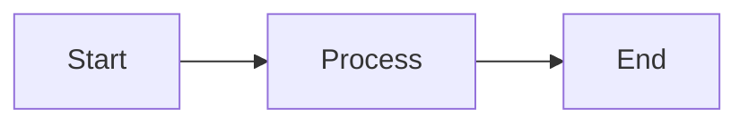

# 🎨 Visual Profile Guide

A complete visual reference for your GitHub profile with examples and customization options.

---

## 🌟 Current Visual Elements

### 1. Animated Header
```markdown

```

**Features:**
- Waving animation
- Gradient colors
- Twinkling effect
- Custom height (180px)

**Customization:**
- Change `type`: waving, wave, rect, slice, shark, cylinder, venom, soft, rounded, transparent
- Change `animation`: fadeIn, scaleIn, blink, twinkling
- Change `height`: Any number (recommended: 120-200)
- Change `text`: Your name or title

---

### 2. Typing Animation
```markdown

```

**Features:**
- Typewriter effect
- Multiple rotating lines
- Custom colors
- Centered alignment

**Customization:**
- Change `font`: Fira+Code, Roboto, Courier+New, etc.
- Change `size`: Font size (recommended: 18-28)
- Change `duration`: Typing speed in ms
- Change `pause`: Pause between lines in ms
- Change `color`: Any hex color
- Change `lines`: Add more with + separator

---

### 3. Status Badges
```markdown


```

**Styles:**
- `flat` - Flat design
- `flat-square` - Flat with square edges
- `for-the-badge` - Large badges (current)
- `plastic` - Plastic look
- `social` - Social media style

**Colors:**
- Named: blue, red, green, yellow, orange, purple, pink, etc.
- Hex: Any hex code (e.g., 00eaff)
- Status: success, important, critical, informational, inactive

---

### 4. Profile Metrics
```markdown


```

**Available Metrics:**
- Profile views (komarev counter)
- Followers count
- Total stars
- Repository count
- Commit count

---

### 5. Tech Stack Badges

#### Language Badges
```markdown


```

#### Framework Badges
```markdown


```

**Find More Logos:**
- Visit [Simple Icons](https://simpleicons.org)
- Search for your technology
- Copy the slug name
- Use in badge URL: `logo=slug-name`

---

### 6. GitHub Stats Cards

#### Stats Card
```markdown

```

**Parameters:**
- `show_icons=true` - Show icons
- `theme=tokyonight` - Color theme
- `include_all_commits=true` - Count all commits
- `count_private=true` - Include private repos
- `hide_border=true` - Remove border
- `bg_color=0d1117` - Background color
- `title_color=00eaff` - Title color
- `icon_color=00eaff` - Icon color
- `text_color=c9d1d9` - Text color
- `hide=stars,commits,prs,issues` - Hide specific stats

#### Top Languages Card
```markdown

```

**Layouts:**
- `compact` - Compact view (current)
- `default` - Standard view
- `donut` - Donut chart
- `donut-vertical` - Vertical donut
- `pie` - Pie chart

---

### 7. GitHub Streak Stats
```markdown

```

**Custom Colors:**
- `background` - Background color
- `ring` - Ring color
- `fire` - Fire icon color
- `currStreakLabel` - Current streak label color
- `sideNums` - Side numbers color
- `sideLabels` - Side labels color
- `dates` - Dates color

---

### 8. Activity Graph
```markdown

```

**Themes:**
- `github` - GitHub theme
- `github-dark` - Dark GitHub
- `tokyo-night` - Tokyo Night (current)
- `dracula` - Dracula
- `high-contrast` - High contrast
- `react-dark` - React dark

---

### 9. GitHub Trophies
```markdown

```

**Options:**
- `row` - Number of rows
- `column` - Number of columns
- `no-frame` - Remove frame
- `no-bg` - Transparent background
- `theme` - Color theme
- `rank` - Filter by rank (SSS,SS,S,AAA,AA,A,B,C)

---

### 10. Project Cards (Table Layout)

```markdown
<table>
<tr>
<td width="50%">

### 🌱 Project Name
**Subtitle**


Description and features

[View Project →](link)

</td>
<td width="50%">

### 📈 Another Project
**Subtitle**


Description

[View Project →](link)

</td>
</tr>
</table>
```

**Benefits:**
- Side-by-side layout
- Visual organization
- Easy to scan
- Professional look

---

## 🎨 Color Schemes

### Current Theme: Tokyo Night
- Background: `#0d1117`
- Primary: `#00eaff` (Cyan)
- Text: `#c9d1d9`
- Accent: Various per element

### Alternative Themes

#### Dracula
- Background: `#282a36`
- Primary: `#bd93f9` (Purple)
- Accent: `#ff79c6` (Pink)

#### Nord
- Background: `#2e3440`
- Primary: `#88c0d0` (Blue)
- Accent: `#81a1c1`

#### Monokai
- Background: `#272822`
- Primary: `#66d9ef` (Cyan)
- Accent: `#a6e22e` (Green)

---

## 🔧 Customization Tips

### 1. Consistent Color Scheme
Use the same colors across all elements:
- Badges: `color=00eaff`
- Stats: `title_color=00eaff&icon_color=00eaff`
- Streak: `ring=00eaff&fire=00eaff`

### 2. Alignment
Center everything for professional look:
```markdown
<div align="center">
  <!-- Your content -->
</div>
```

### 3. Spacing
Add `---` between sections for visual separation.

### 4. Badge Grouping
Group related badges together:
- Languages in one section
- Frameworks in another
- Tools in another

### 5. Responsive Images
Use `height` parameter to keep images consistent:
```markdown

```

---

## 📊 Layout Patterns

### Pattern 1: Hero Section
```
Header Image
↓
Typing Animation
↓
Status Badges
↓
Metrics (Views, Followers, Stars)
```

### Pattern 2: Content Sections
```
About Me
↓
Projects (Table Layout)
↓
Tech Stack (Grouped Badges)
↓
GitHub Stats (Multiple Cards)
```

### Pattern 3: Footer
```
Navigation Links
↓
Social Badges
↓
Footer Image
↓
Timestamp
```

---

## 🚀 Advanced Features

### Mermaid Diagrams
```markdown

```

### Collapsible Sections
```markdown
<details>
<summary>Click to expand</summary>

Hidden content here

</details>
```

### Custom HTML
```markdown
<div align="center">
  <h3>Custom Heading</h3>
  <p>Custom paragraph</p>
</div>
```

---

## 📱 Mobile Optimization

### Tips:
1. Use `width=100%` for full-width images
2. Stack elements vertically
3. Use responsive tables
4. Test on mobile view
5. Keep text readable (min 16px)

---

## 🎯 Best Practices

### Do's ✅
- Use consistent colors
- Keep it organized
- Update regularly
- Test all links
- Optimize image sizes
- Use alt text

### Don'ts ❌
- Overload with badges
- Use too many colors
- Forget mobile users
- Leave broken links
- Use low-quality images
- Ignore accessibility

---

## 🔄 Update Frequency

### Automated (via GitHub Actions):
- Timestamp: Daily
- Stats: Every 6 hours
- Activity graph: Real-time

### Manual:
- Project descriptions: As needed
- Tech stack: When learning new tech
- Links: When adding new projects

---

## 📚 Resources

### Badge Generators
- [Shields.io](https://shields.io) - Custom badges
- [Simple Icons](https://simpleicons.org) - Logo slugs

### Stats Services
- [GitHub Readme Stats](https://github.com/anuraghazra/github-readme-stats)
- [GitHub Streak Stats](https://github.com/DenverCoder1/github-readme-streak-stats)
- [Activity Graph](https://github.com/Ashutosh00710/github-readme-activity-graph)
- [Profile Trophy](https://github.com/ryo-ma/github-profile-trophy)

### Animation Services
- [Capsule Render](https://github.com/kyechan99/capsule-render)
- [Typing SVG](https://github.com/DenverCoder1/readme-typing-svg)

### Inspiration
- [Awesome GitHub Profile README](https://github.com/abhisheknaiidu/awesome-github-profile-readme)
- [GitHub Profile README Generator](https://rahuldkjain.github.io/gh-profile-readme-generator/)

---

**Your profile is now visually stunning and easy to understand!** 🎨✨
